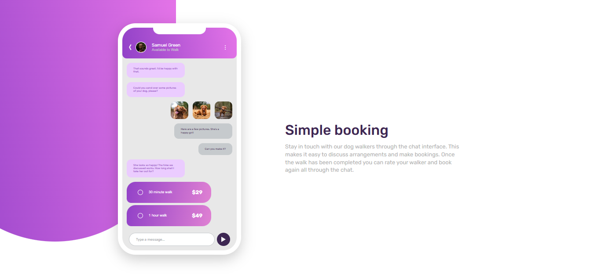

# Frontend Mentor - Chat app CSS illustration solution

This is a solution to the [Chat app CSS illustration challenge on Frontend Mentor](https://www.frontendmentor.io/challenges/chat-app-css-illustration-O5auMkFqY). Frontend Mentor challenges help you improve your coding skills by building realistic projects. 

## Table of contents

- [Overview](#overview)
  - [The challenge](#the-challenge)
  - [Screenshot](#screenshot)
- [My process](#my-process)
  - [Built with](#built-with)
  - [What I learned](#what-i-learned)
  - [Continued development](#continued-development)
- [Author](#author)

## Overview

### The challenge

Users should be able to:

- View the optimal layout for the component depending on their device's screen size

##### _**Bonus**: See the chat interface animate on the initial load_

Although I haven't used the animation on this page yet, I will definitely add some great animation in the future.

### Screenshot

## My process

### Built with

- HTML5 markup
- CSS custom properties
- Flexbox
- Mobile-first workflow

### What I learned

I learned a few things while working on this project.  It was a novel experience for me to create an entire mobile component using only CSS, and I'm in awe of my own abilities.  I think I'm capable of more now.  I've never used CSS as a tool to build components from the ground up.  However, I suppose I now have the superpower of being able to create any component using just CSS.

### Continued development

I discovered a lot of topics while working on this project that I was unaware of, but I learned about them through research.  However, I believe that if I study the topic more thoroughly, I can perform better; I was having trouble with the psudo elements.

## Author

- Frontend Mentor - [@hafizurrahaman0](https://www.frontendmentor.io/profile/hafizurrahaman0)
- Twitter - [@_hafizurrahaman](https://www.twitter.com/_hafizurrahaman)